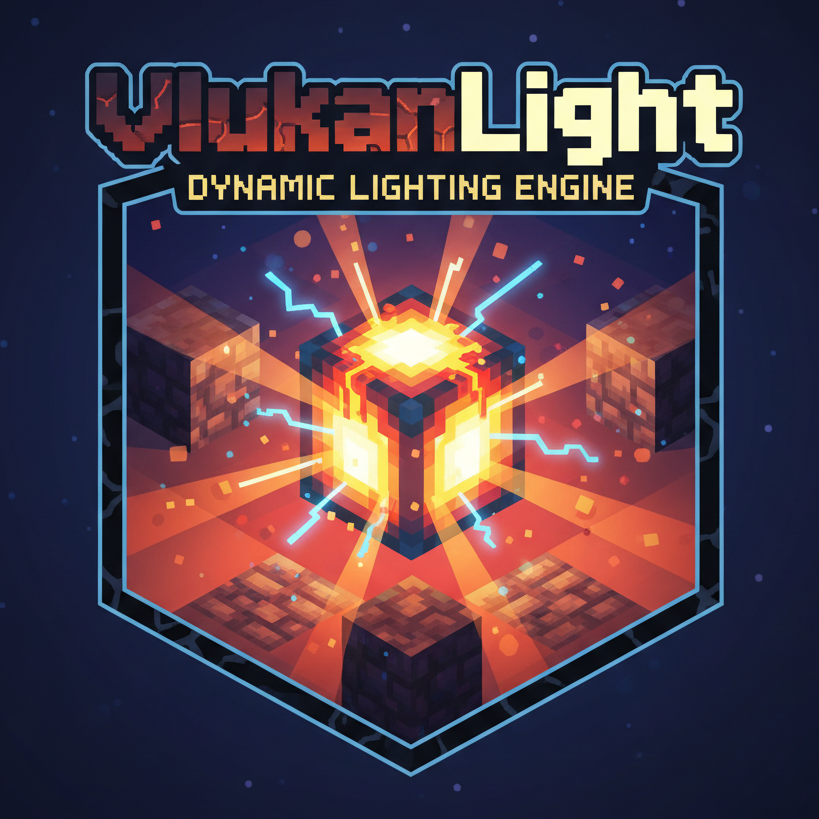

<div align="center">
  

# 🌋 VulkanLight 🔦

**Dynamic lighting that actually works with VulkanMod. 🔥**
</div>

Hold a torch, get light around you. But here's the thing: this mod uses **Vulkan rendering** for dynamic lighting, making it the first (and currently only) dynamic lighting solution built specifically for VulkanMod.

---

## Why This Exists

Dynamic lighting mods? Sure, they exist. Dozens of them.

**But here's the problem:** None of them work properly with [VulkanMod](https://github.com/xCollateral/VulkanMod). They're all built for vanilla rendering or Sodium/Iris, which means if you're using Vulkan for better performance, you're stuck in the dark.

VulkanLight changes that. It's built from the ground up to work with VulkanMod's Vulkan renderer, giving you smooth, performant dynamic lighting that doesn't fight with your rendering engine.

**Plus:** It's 100% client-side. Install it, join any server, and it just works. No server-side installation needed.

---

## What Makes This Different

### 🎯 Built for VulkanMod
Uses Vulkan rendering pipeline for lighting calculations. Other dynamic lighting mods don't work with VulkanMod because they rely on OpenGL rendering hooks. This one actually speaks Vulkan.

### 🌐 Fully Client-Side
No server installation required. Install it on your client and join any vanilla or modded server. Your torches will light up the world only for you.

### ⚡ Performance-Focused
Leverages Vulkan's efficiency. If you're using VulkanMod for performance, this won't undo all that work.

---
## What Actually Works

**Right Now:**
- Hold a torch → light appears around you (wild concept)
- Works with both hands because we're not savages
- Different items = different brightness (a lava bucket lights up more than glowstone dust, shocking)
- Doesn't murder your FPS (probably)

**Stuff That Glows:**
- All the torches (even the emo soul torches)
- Lanterns
- That one lava bucket you always carry
- Glowstone and its dust form
- Jack o'Lanterns (spooky lighting)
- Blaze rods (because holding fire is normal)
- Those weird frog lights
- Glow berries
- Basically if it glows in Minecraft, it'll glow here

## Installing This Thing

**You Need:**
1. Fabric (the mod loader, not the textile)
2. [VulkanMod](https://github.com/xCollateral/VulkanMod) ← IMPORTANT. This won't work without it.
3. This mod (obviously)

**Steps:**
1. Install Fabric if you haven't
2. Get VulkanMod (seriously, don't skip this)
3. Download VulkanLight
4. Throw it in your mods folder
5. Launch game
6. Hold torch
7. Be amazed that this wasn't in vanilla

## The Roadmap (aka "I'll Do It Eventually")

### ✅ Phase 1: Make It Work
- ✅ Torches in hand = light (done!)
- ✅ Don't crash the game (surprisingly hard)
- ✅ Make code not look like spaghetti

### 🔨 Phase 2: Dropped Items
- [ ] That torch you just dropped? Should still glow
- [ ] Yes, I know you drop items a lot
- [ ] Make it not lag when you drop 500 torches (why would you do this)

### 🐲 Phase 3: Glowing Mobs
- [ ] Blazes should actually light things up
- [ ] Magma cubes too
- [ ] That glowing squid everyone forgot about
- [ ] Make your friend's torch light things up in multiplayer

### ⚙️ Phase 4: Settings (Because Everyone Wants Options)
- [ ] Config menu so you can tweak stuff
- [ ] "Make torches brighter" slider
- [ ] "Turn off the thing I don't like" button
- [ ] Let other mods add their glowy things

### ✨ Phase 5: Make It Pretty
- [ ] Flickering torches (atmospheric!)
- [ ] Smooth light fade-in/out (fancy!)
- [ ] Colored lights (RGB everything!)
- [ ] Light gets dimmer as torch burns out (immersive!)

### 🎯 Phase 6: The Final Boss
- [ ] Add Notch

## Does It Work With X?

**YES:**
- ✅ VulkanMod (required, duh)
- ✅ Fabric API
- ✅ Most normal mods

**NO:**
- ❌ Sodium/Iris (use VulkanMod instead, that's literally the point)
- ❌ Other dynamic lighting mods (they'll fight each other)
- ❌ OptiFine (if you're still using that in 2024... why?🥀🥀)

## Building From Source

```bash
git clone https://github.com/AugustLigh/vulkanlight
cd vulkanlight
./gradlew build
# jar is in build/libs/
```

Or just download from Releases like a normal person.

## Credits

- **[VulkanMod](https://github.com/xCollateral/VulkanMod)** by xCollateral - The only reason this works
- Notch - For creating Minecraft and then selling it for billions (legend)
- Mojang - For not adding this feature in 15 years

## Bug Reports

Found a bug? Cool, tell me about it in [Issues](../../issues).

Please include:
- What you were doing
- What exploded
- Your mod list (yes, all of it)
- That one screenshot that's somehow blurry

## Legal Stuff

MIT License. Do whatever you want with it. Make it better. Make it worse. I'm not your mom.

Just don't sell it or claim you made it. That's uncool. 😭

---

**Made by someone who was tired of placing torches every 3 seconds**

*This mod contains 0% Herobrine. We checked.*